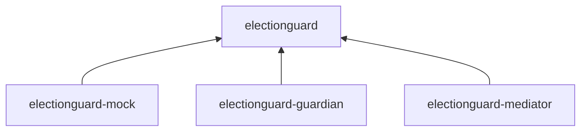
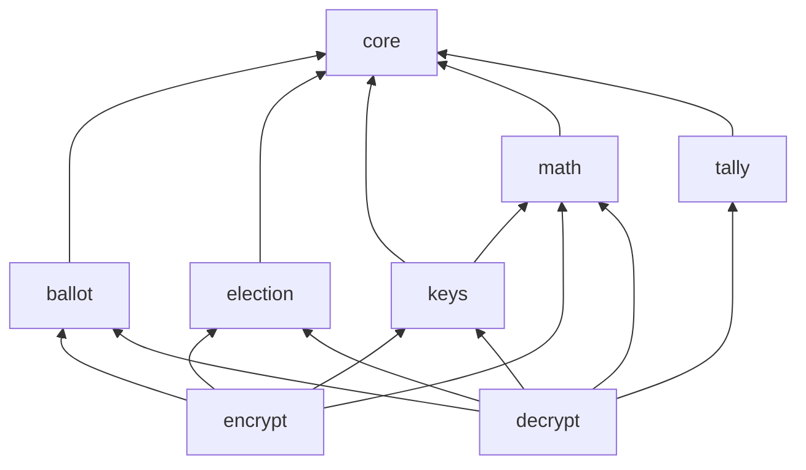

# Modules

## Module Dependency



<br/>

## electionguard
The base of ElectionGuard with preferably stateless and functional methods with a focus on data transfer objects. 


<br/>

**Example:**
```
 📂 math
 --- __init__.py
 --- chaum_pedersen.py
 --- discrete_log.py
 --- elgamal.py
 --- group.py
 --- hash.py
 --- nonces.py
 --- polynomial.py
 --- proof.py
 --- schnorr.py
```

## electionguard-mock

The mock framework for testing purposes and creating sample data. 

## electionguard-guardian

Stateful guardian implementation to provide easy access to methods and store the keys within state for a guardian.

## electionguard-mediator

Stateful mediator implementations to handle election setup, key ceremony, ballot counting (ballot box), tally decryption, and publishing.